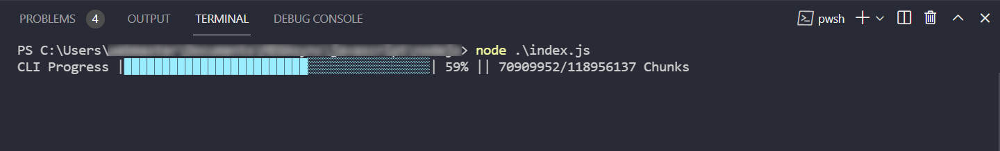

# node-gzip

Use nodejs to gzip/gunzip large files with the node file system stream and progress bar.
Max memory usage is about 30MB, no matter how large file is.

Windows cmd line:
1. Clone repository: git clone https://github.com/webmastersmith/node-gzip.git
2. cd into directory
3. npm i
4. point gzip to your file:
   * Gzip(input, output.gz)
   * Gunzip(input.gz, output)
5. run from command line: node .\index.js

